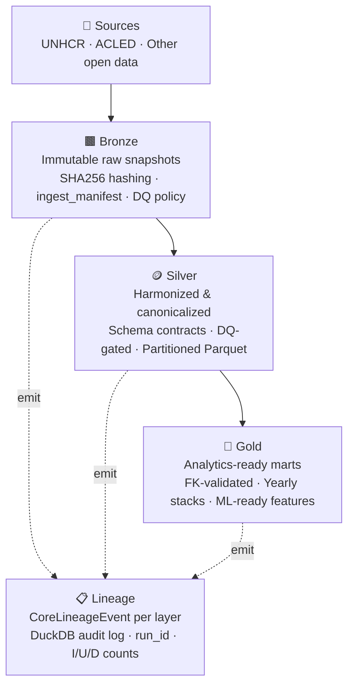

# Conflict & Crisis Data Warehouse


Every year, tens of millions of people are forcibly displaced by conflict, persecution, and crisis — yet the open data describing these movements is fragmented, inconsistently formatted, and difficult to combine. This project builds a **production-grade data engineering pipeline** that ingests UNHCR refugee flows and ACLED conflict events, enforces **data quality contracts at every layer**, and produces analytics-ready outputs with full **lineage and reproducibility guarantees**, emulating a production enviromnet, locally.

---

## Architecture



Each layer is **gated**: a partition only promotes if it passes all DQ checks defined in the YAML schema contract for that entity.

---

## Output Example

A sample of the `gold.refugee_stack_yearly` mart — actual pipeline output, 2020 partition (5,488 origin–destination combinations):

| country_origin | country_destination | year | refugees | asylum_seekers | population_of_concern |
|---|---|---|---|---|---|
| AFG | ALB | 2020 | 0 | 0 | 5 |
| AFG | EGY | 2020 | 34 | 44 | 78 |
| AFG | ARG | 2020 | 12 | 0 | 12 |
| AFG | ARM | 2020 | 5 | 0 | 5 |
| AFG | AUS | 2020 | 10,659 | 1,761 | 12,420 |
| ZWE | SWE | 2020 | 18 | 10 | 28 |
| ZWE | CHE | 2020 | 12 | 5 | 17 |
| ZWE | USA | 2020 | 756 | 1,041 | 1,797 |

> See `notebooks/exploration.ipynb` for a live query against the gold layer with full output.

---

## Tech Stack

| Area | Tools |
|------|-------|
| Data Engine | **DuckDB**, Parquet |
| Orchestration | `make`, Python CLI (`typer`) |
| Quality & Validation | Custom `DQBuilder`, YAML schema contracts |
| Lineage & Auditability | `CoreLineageEvent`, DuckDB audit log |
| Logging | `structlog` (structured JSON) |
| Testing | `pytest`, synthetic datasets |
| Environment | `uv`, `pre-commit`, `ruff` |

---

## Quickstart

**Prerequisites:** UNHCR and/or ACLED source files placed in `data/raw/`.
See `src/diff/router.yaml` for the expected file patterns and routing rules.

```bash
# 1. Clone
git clone https://github.com/Costinha66/conflit_warehouse
cd conflit_warehouse

# 2. Install dependencies
uv sync

# 3. Install pre-commit hooks
make setup

# 4. Run the full pipeline (via Prefect)
make run.flow      # bronze → diff → silver → gold, orchestrated by Prefect

# — or run each stage manually —
make run.bronze    # ingest raw CSVs → bronze snapshots
make run.diff      # discover files, populate ingest_manifest, route partitions
make run.silver    # harmonize + canonicalize → silver tables
make run.gold      # aggregate → gold analytics marts

# 5. Explore results
duckdb warehouse/database.db
```

---

## Data Versioning (DVC)

Bronze snapshots are versioned with [DVC](https://dvc.org). A local remote is pre-configured at `./dvc_store`.

```bash
# After cloning, restore the latest bronze snapshots
dvc pull

# After a pipeline run, push new snapshots to the local store
dvc add warehouse/bronze && dvc push
```

The `warehouse/bronze.dvc` pointer file is committed to git and tracks the content hash of every bronze snapshot. `dvc pull` restores the actual Parquet files from the local store.

---

## Repository Structure

```
conflit_warehouse/
│
├─ src/
│  ├─ bronze/
│  │  └─ snapshot_maker.py        # snapshot creation + metrics + DQ
│  ├─ diff/
│  │  ├─ discovery.py             # scan bronze, populate ingest_manifest
│  │  ├─ router.yaml              # source → entity routing rules
│  │  ├─ parser.py, planner.py, router.py
│  ├─ silver/
│  │  ├─ processor.py             # canonicalize + harmonize → silver tables
│  │  ├─ canonilaze.py, harmonizer.py
│  ├─ gold/
│  │  └─ processor_gold.py        # build analytics marts from silver
│  ├─ core/
│  │  ├─ types.py, config.py, logging.py, metrics.py
│  │  ├─ dq/                      # DQ checks (schema, PK, FK, non-negative, reconcile)
│  │  └─ lineage/                 # CoreLineageEvent models & emitters
│  ├─ infra/
│  │  ├─ duckdb/                  # DuckDB I/O helpers
│  │  └─ yaml_sql/                # SQL generation from YAML specs
│  └─ others/
│     ├─ ddls.py                  # DDL generators (ingest_manifest, silver, gold, dims)
│     └─ load_dim_country.py      # country dimension loader
│
├─ schemas/
│  ├─ silver/                     # e.g., refugees_stack.yaml
│  └─ gold/                       # e.g., refugees_stack_yearly.yaml
│
├─ tests/
│  └─ test_diff.py
│
├─ docs/
│  └─ decisions.md                # architectural decisions & DQ policy
│
├─ notebooks/
│  └─ exploration.ipynb           # gold-layer queries, DQ reports, lineage traces
│
├─ makefile
├─ pyproject.toml
└─ .pre-commit-config.yaml
```

---

## How the Pipeline Works

1. **Bronze** — Source CSVs/Parquets are written as immutable partitioned snapshots. Each snapshot records row count, byte size, and SHA256 hash. A DQ policy runs before the snapshot is committed.

2. **Discovery → Manifest** — `discovery.py` scans the bronze root, hashes each file, and populates an `ingest_manifest` table in DuckDB. `router.yaml` maps file patterns to entities and partitions. Dirty routes (new or changed files) are flagged for silver processing.

3. **Silver** — Each dirty partition is loaded, harmonized (type casting, normalization), and canonicalized (dimensional joins, deduplication, row hash). Schema contracts in `schemas/silver/*.yaml` enforce column types, primary keys, and DQ rules before the partition is written.

4. **Gold** — `processor_gold.py` reads the latest promoted silver partitions and builds yearly aggregate marts. Foreign key integrity and reconciliation assertions (e.g., `population_of_concern = cross_border_total + internal_total`) are checked before the gold table is written.

5. **Lineage** — A `CoreLineageEvent` is emitted at each layer (discovery, transform, partition publish), capturing: `run_id`, `entity`, `layer`, `transform_version`, insert/update/delete counts, DQ status, and input file hashes. Events are written to a DuckDB audit log and to stdout as structured JSON.

---

## Key Design Decisions

See [`docs/decisions.md`](docs/decisions.md) for full rationale. Highlights:

- **DuckDB over Postgres/Spark** — columnar OLAP engine with zero infrastructure overhead; handles hundreds of millions of rows comfortably on a single machine for this data scale.
- **Medallion + snapshot semantics** — cumulative snapshots enable point-in-time reproducibility and safe replay (`make replay` reprocesses silver and gold from existing bronze).
- **YAML schema contracts** — schema, DQ rules, and transform logic colocated in one file per entity; the pipeline reads these at runtime rather than hardcoding transforms.

---

## Author

Filipe Costa — Data Science @ JADS

## License

MIT License © 2025 Filipe Costa
